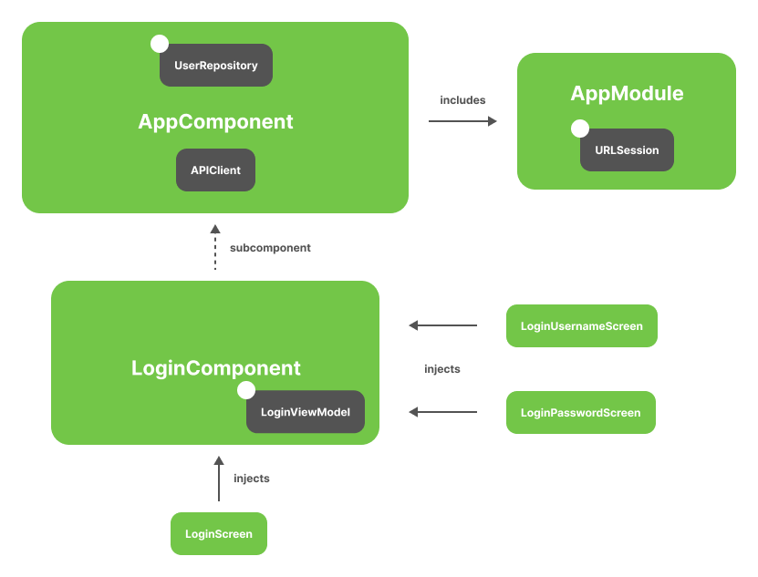

<h1 align="center">🗡️Sword</h1>
<p align="center">A compile time dependency injection library for Swift</p>
<p align="center">
  <a href="https://github.com/rockname/sword/actions"></a>
  <a href="LICENSE"></a>
</p>

---

# Introduction
Sword is a compile time dependency injection library for Swift, inspired by [Dagger](https://dagger.dev/).

As you declare dependencies and specify how to satisfy them using [Swift Macros](https://docs.swift.org/swift-book/documentation/the-swift-programming-language/macros/), Sword automatically generates dependency injection code at compile time. Sword walks through your code and validates dependency graphs, ensuring that every object's dependencies can be satisfied, so there are no runtime errors.

# Installation

## Xcode Package Dependency

Use the following link to add Sword as a Package Dependency to an Xcode project:

```
https://github.com/rockname/sword
```

> [!IMPORTANT]
> Do not add the `SwordCommand` executable to any targets.
> Ensure `None` is selected when asked to choose package products.

## Swift Package Manager

Add the following to the package `dependencies` in your `Package.swift`:

```swift
.package(url: "https://github.com/rockname/sword.git", from: "<version>")
```

Then, include "Sword" as a dependency for your target:

```swift
.target(
  name: "<target>",
  dependencies: [
    .product(name: "Sword", package: "sword"),
  ]
),
```

# Setup

Sword provides a build tool plugin to generate dependency injection code.

The build tool plugin can be used in both Xcode projects and Swift Package projects.

## Xcode projects

> [!NOTE]
> Requires installing via [Xcode Package Dependency](#xcode-package-dependency).

Add the `SwordBuildToolPlugin` to the `Run Build Tool Plug-ins` phase of the `Build Phases` for the target.

> [!TIP]
> When using the plugin for the first time, be sure to trust and enable
> it when prompted. If a macros build warning exists, select it to trust
> and enable the macros as well.

## Swift Package projects

> [!NOTE]
> Requires installing via [Swift Package Manager](#swift-package-manager).

Add the plugin to the application root target as follows:

```swift
.target(
    ...
    plugins: [.plugin(name: "SwordBuildToolPlugin", package: "Sword")]
),
```

## Xcode + Swift Package projects

Add the `SwordBuildToolPlugin` as mentioned above [Xcode projects](#xcode-projects).

Then add a `.sword.yml` file into your Xcode project's root directory for Sword to read the file and generate your dependency graph considering local Swift Packages.

For example:

```yml
local_packages:
  - path: PackageA
    targets:
      - DependencyA
      - DependencyB
  - path: PackageB
    targets:
      - DependencyC
      - DependencyD
```

# Usage

Consider an example SwiftUI app with the dependency graph from the following image.


## Component

You usually create a Sword dependency graph in your App struct (or root View) because you want an instance of the graph to be in memory as long as the app is running. In this way, the graph is attached to the app lifecycle.

In Sword, `@Component` is attached to the dependency graph. So you can call it `AppComponent`. You usually keep an instance of that component in your custom `App` struct as shown in the following:

```swift
// Definition of the App dependency graph
@Component
final class AppComponent {
}

// AppComponent lives in the App struct to share its lifecycle
@main
struct MyApp: App {
  let component = AppComponent()

  var body: some Scene { ... }
}
```

Instead of creating the dependencies a View requires in the `init`, you can get a dependency you want from the Component.

```swift
struct LoginNavigation: View {
  let component: AppComponent

  var body: some View {
    ...
    LoginScreen(viewModel: component.loginViewModel)
    ...
  }
}

struct LoginScreen: View {
  let viewModel: LoginViewModel

  var body: some View { ... }
}
```

## Dependency

Sword needs to know required dependencies to provide the `LoginViewModel`. You can tell Sword how to initialize `LoginViewModel` using `@Dependency` / `@Injected` like following:

```swift
// You want Sword to provide an object of LoginViewModel from the AppComponent graph
@Dependency(registeredTo: AppComponent.self)
final class LoginViewModel {
  private let userRepository: UserRepository

  @Injected
  init(userRepository: UserRepository) {
    self.userRepository = userRepository
  }
}
```

Let's tell Sword how to provide the rest of the dependencies to build the graph:

```swift
@Dependency(registeredTo: AppComponent.self)
final class UserRepository {
  private let apiClient: APIClient

  @Injected
  init(apiClient: APIClient) {
    self.apiClient = apiClient
  }
}

@Dependency(registeredTo: AppComponent.self)
final struct APIClient {
  private let urlSession: URLSession

  @Injected
  init(urlSession: URLSession) {
    self.urlSession = urlSession
  }
}
```

## Binding

When you provide an interface for a dependency, use `boundTo` parameter on `@Dependency`.

```swift
protocol APIClient { ... }

// You want Sword to provide a DefaultAPIClient implementation for APIClient interface
@Dependency(
  registeredTo: AppComponent.self,
  boundTo: APIClient.self
)
final struct DefaultAPIClient: APIClient {
  ...
}
```

## Module

For this example, `APIClient` has a dependency on `URLSession`. However, the way to create an instance of `URLSession` is different from what you've been doing until now. It's initializer is defined in the Foundation framework.

Apart from the `@Injected`, there's another way to tell Sword how to provide a required dependency: the information inside Sword modules. A Sword module is a struct that is attached with `@Module`. There, you can define dependencies with the `@Provider`.

```swift
// @Module informs Sword that this struct is a Sword Module registered to AppComponent
@Module(registeredTo: AppComponent.self)
struct AppModule {
  // @Provider tells Sword how to create the dependency.
  @Provider
  static func urlSession() -> URLSession {
    let configuration = URLSessionConfiguration.default
    configuration.timeoutIntervalForRequest = 30
    return URLSession(configuration: configuration)
  }
}
```

This is how the Sword graph in the example looks right now:


The entry point to the graph is `LoginScreen`. Because `LoginScreen` injects `LoginViewModel`, Sword builds a graph that knows how to provide an instance of `LoginViewModel`, and recursively, of its dependencies. Sword knows how to do this because of the `@Injected` on the dependencies' initializer.

## Scope

You can use `Scope` to limit the lifetime of an object to the lifetime of its component. This means that the same instance of a dependency is used every time that type needs to be provided.

To have a unique instance of a `UserRepository` when you ask for the repository in `AppComponent`, pass `.single` to the `scopedWith` parameter on `@Dependency`.

```swift
@Dependency(
  registeredTo: AppComponent.self,
  scopedWith: .single
)
final class UserRepository { ... }
```

You can also use the `scopedWith` parameter in `@Provider`.

```swift
@Module(registeredTo: AppComponent.self)
struct AppModule {
  @Provider(scopedWith: .single)
  static func urlSession() -> URLSession { ... }
}
```

## Subcomponent

If your login flow consists of multiple views, you would want to reuse the same instance of `LoginViewModel` in all views. But you should not use `signle` scope in `AppComponent` for the following reasons:

1. The instance of `LoginViewModel` would persist in memory after the login flow has finished.

2. You want a different instance of `LoginViewModel` for each login flow. For example, if the user logs out, you want a different instance of `LoginViewModel`, rather than the same instance as when the user logged in for the first time.

To scope `LoginViewModel` to the lifecycle of login flow, you need to create a new component for the login flow.

The new component must be able to access the objects from `AppComponent` because `LoginViewModel` depends on `UserRepository`. The way to tell Sword that you want a new component to use part of another component is with Sword `Subcomponent`. The new component must be a subcomponent of the component containing shared resources.

In the example, you must define `LoginComponent` as a subcomponent of `AppComponent` like following:

```swift
// You tell Sword that LoginComponent is a subcomponent of AppComponent
@Subcomponent(of: AppComponent.self)
final class LoginComponent {
}
```

A factory method `func makeLoginComponent() -> LoginComponent` will be generated in `AppComponent`.
You call this method when starting the login flow.

```swift
@main
struct MyApp: App {
  let component = AppComponent()

  var body: some Scene {
    ...
    LoginNavigation(component: component.makeLoginComponent())
    ...
  }
}

struct LoginNavigation: View {
  let component: LoginComponent

  var body: some View {
    ...
    LoginScreen(viewModel: component.loginViewModel)
    ...
  }
}
```

Then, as you set `LoginComponent.self` to `registeredTo` and `.single` to `scopedWith` on `@Dependency` of `LoginViewModel`, the instance of `LoginViewModel` would be unique in each login flow.

```swift
@Dependency(
  registeredTo: LoginComponent.self,
  scopedWith: .single
)
final class LoginViewModel { ... }
```

Here is how the Sword graph looks with the new subcomponent. The classes with a white dot (`UserRepository`, `URLSession`, and `LoginViewModel`) are the ones that have a unique instance scoped to their respective components.



## Component Arguments

You can pass some arguments to a component as a dependency.

For example, you can inject environment variables, `EnvVars`, to `AppComponent` like following:

```swift
struct EnvVars {
  let baseURL: URL
}

@Component(arguments: .init(EnvVars.self))
final class AppComponent {
}
```

Then, the `@Component` macro generates an initializer receiving `EnvVars` as a parameter.

```swift
let component = AppComponent(
  envVars: EnvVars(baseURL: URL(string: "https://example.com")!)
)
```

Now you can resolve an `EnvVars` dependency via `AppComponent`.

```swift
@Dependency(
  registeredTo: AppComponent.self,
  boundTo: APIClient.self,
  scopedWith: .single
)
final class DefaultAPIClient: APIClient {
  private let baseURL: URL

  @Injected
  init(envVars: EnvVars) {
    self.baseURL = envVars.baseURL
  }
}
```

## Assisted Injection

Assisted injection is a dependency injection (DI) pattern that is used to construct an object where some parameters may be provided by the DI framework and others must be passed in at creation time (a.k.a “assisted”) by the user.

To use Sword’s assisted injection, annotate any assisted parameters with `@Assisted`, as shown below:

```swift
@Dependency(registeredTo: AppComponent.self)
class UserDetailViewModel {
  ...

  @Injected
  init(
    @Assisted userID: User.ID,
    userRepository: UserRepository
  ) {
    self.userID = userID
    self.userRepository = userRepository
  }
}
```

Then you can pass the assisted parameter when using the dependency as shown below.

```swift
struct UserNavigation: View {
  let component: AppComponent

  var body: some View {
    ...
    UserDetailScreen(viewModel: component.userDetailViewModel(userID: userID))
    ...
  }
}
```

# Features

| Feature | Support Status |
| --- | --- |
| Subcomponent | ✅ Supported |
| Component Arguments | ✅ Supported |
| Single Scope | ✅ Supported |
| Weak Reference Scope | 🚧 TBD |
| Assisted Injection | ✅ Supported |
| Multi Binding | 🚧 TBD |
| Missing Dependency Error | ✅ Supported |
| Duplicate Dependency Error | ✅ Supported |
| Cycle Dependency Error | 🚧 TBD |

# License
This library is released under the MIT license. See [LICENSE](LICENSE) for details.
